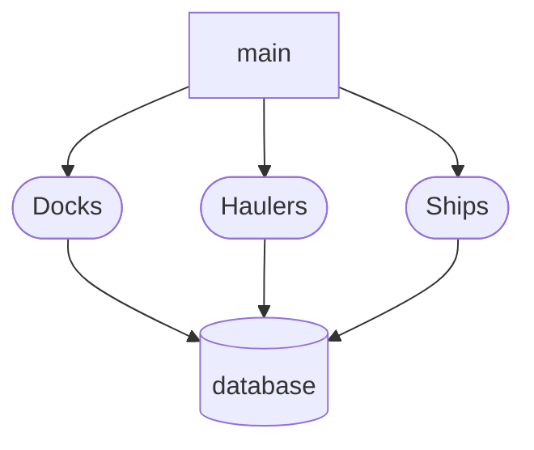
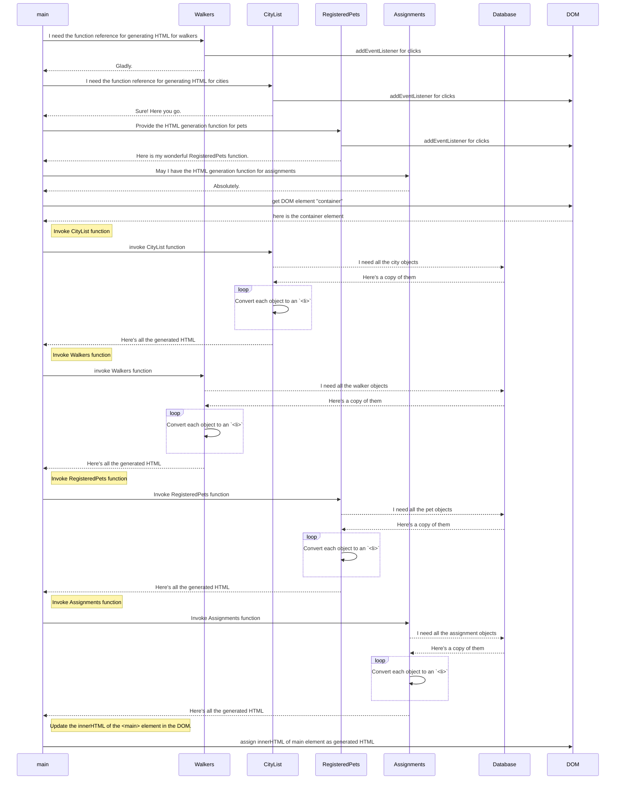
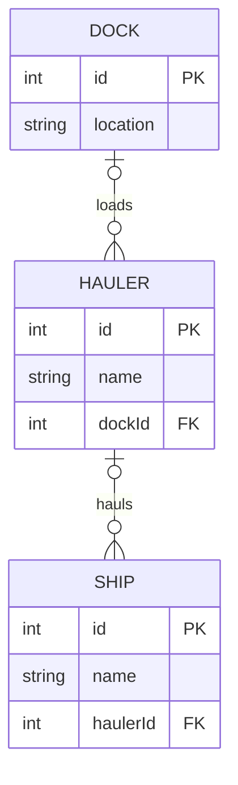

# DeShawn's Dog Walking

## Dependancy Graph

```mermaid
flowchart TD
    main["main"]
    Docks(["Docks"])
    Haulers(["Haulers"])
    Ships(["Ships"])
    database[("database")]
    main-->Docks
    main-->Haulers
    main-->Ships
    Docks-->database
    Haulers-->database
    Ships-->database
```

## Sequence Diagram

```mermaid
sequenceDiagram
    participant main
    participant Walkers
    participant CityList
    participant RegisteredPets
    participant Assignments
    participant Database
    main->>Walkers: I need the function reference for generating HTML for walkers
    Walkers->>DOM: addEventListener for clicks
    Walkers-->>main: Gladly.
    main->>CityList: I need the function reference for generating HTML for cities
    CityList->>DOM: addEventListener for clicks
    CityList-->>main: Sure! Here you go.
    main->>RegisteredPets: Provide the HTML generation function for pets
    RegisteredPets->>DOM: addEventListener for clicks
    RegisteredPets-->>main: Here is my wonderful RegisteredPets function.
    main->>Assignments: May I have the HTML generation function for assignments
    Assignments-->>main: Absolutely.
    main->>DOM: get DOM element "container"
    DOM-->>main: here is the container element
    Note right of main: Invoke CityList function
    main->>CityList: invoke CityList function
    CityList-->>Database: I need all the city objects
    Database-->>CityList: Here's a copy of them
    loop
        CityList->>CityList: Convert each object to an `<li>`
    end
    CityList-->>main: Here's all the generated HTML
    Note right of main: Invoke Walkers function
    main->>Walkers: invoke Walkers function
    Walkers-->>Database: I need all the walker objects
    Database-->>Walkers: Here's a copy of them
    loop
        Walkers->>Walkers: Convert each object to an `<li>`
    end
    Walkers-->>main: Here's all the generated HTML
    Note right of main: Invoke RegisteredPets function
    main->>RegisteredPets: Invoke RegisteredPets function
    RegisteredPets-->>Database: I need all the pet objects
    Database-->>RegisteredPets: Here's a copy of them
    loop
        RegisteredPets->>RegisteredPets: Convert each object to an `<li>`
    end
    RegisteredPets-->>main: Here's all the generated HTML
    Note right of main: Invoke Assignments function
    main->>Assignments: Invoke Assignments function
    Assignments-->>Database: I need all the assignment objects
    Database-->>Assignments: Here's a copy of them
    loop
        Assignments->>Assignments: Convert each object to an `<li>`
    end
    Assignments-->>main: Here's all the generated HTML
    Note right of main: Update the innerHTML of the <main> element in the DOM.
    main->>DOM: assign innerHTML of main element as generated HTML
```

## Entity Relationship Diagram

```mermaid
erDiagram
    DOCK |o--o{ HAULER : loads
    HAULER |o--o{ SHIP : hauls 
    SHIP {
        int id PK
        string name
        int haulerId FK
    }
    HAULER {
        int id PK
        string name 
        int dockId FK
    }
    DOCK {
        int id PK
        string location
    }
```
