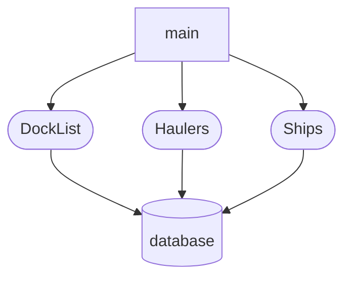
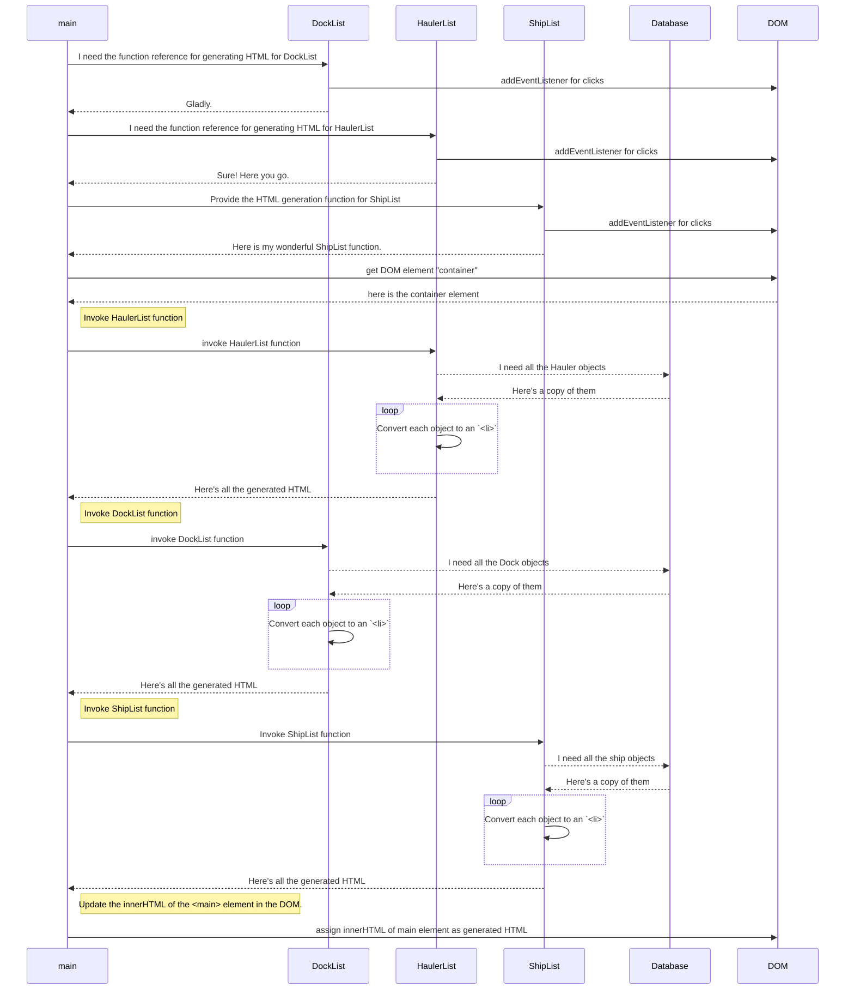
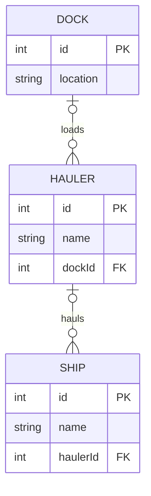

# Shipping Ship Ships 

## Dependancy Graph

```mermaid
flowchart TD
    main["main"]
    DockList(["DockList"])
    Haulers(["Haulers"])
    Ships(["Ships"])
    database[("database")]
    main-->DockList
    main-->Haulers
    main-->Ships
    DockList-->database
    Haulers-->database
    Ships-->database
```

## Sequence Diagram

```mermaid
sequenceDiagram
    participant main
    participant DockList
    participant HaulerList
    participant ShipList
    participant Database
    main->>DockList: I need the function reference for generating HTML for DockList
    DockList->>DOM: addEventListener for clicks
    DockList-->>main: Gladly.
    main->>HaulerList: I need the function reference for generating HTML for HaulerList
    HaulerList->>DOM: addEventListener for clicks
    HaulerList-->>main: Sure! Here you go.
    main->>ShipList: Provide the HTML generation function for ShipList
    ShipList->>DOM: addEventListener for clicks
    ShipList-->>main: Here is my wonderful ShipList function.
    main->>DOM: get DOM element "container"
    DOM-->>main: here is the container element
    Note right of main: Invoke HaulerList function
    main->>HaulerList: invoke HaulerList function
    HaulerList-->>Database: I need all the Hauler objects
    Database-->>HaulerList: Here's a copy of them
    loop
        HaulerList->>HaulerList: Convert each object to an `<li>`
    end
    HaulerList-->>main: Here's all the generated HTML
    Note right of main: Invoke DockList function
    main->>DockList: invoke DockList function
    DockList-->>Database: I need all the Dock objects
    Database-->>DockList: Here's a copy of them
    loop
        DockList->>DockList: Convert each object to an `<li>`
    end
    DockList-->>main: Here's all the generated HTML
    Note right of main: Invoke ShipList function
    main->>ShipList: Invoke ShipList function
    ShipList-->>Database: I need all the ship objects
    Database-->>ShipList: Here's a copy of them
    loop
        ShipList->>ShipList: Convert each object to an `<li>`
    end
    ShipList-->>main: Here's all the generated HTML
    Note right of main: Update the innerHTML of the <main> element in the DOM.
    main->>DOM: assign innerHTML of main element as generated HTML
```

## Entity Relationship Diagram

```mermaid
erDiagram
    DOCK |o--o{ HAULER : loads
    HAULER |o--o{ SHIP : hauls 
    SHIP {
        int id PK
        string name
        int haulerId FK
    }
    HAULER {
        int id PK
        string name 
        int dockId FK
    }
    DOCK {
        int id PK
        string location
    }
```
